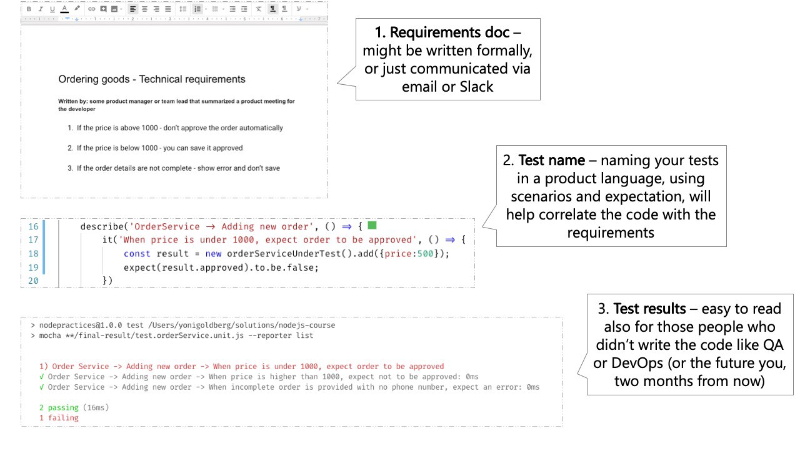

# Sunday, August 7, 2022

[[Journal]]
[[javascript]]
[[testing]]

자바스크립트 테스트 주도 개발: [https://github.com/goldbergyoni/javascript-testing-best-practices/blob/master/readme.kr.md](https://github.com/goldbergyoni/javascript-testing-best-practices/blob/master/readme.kr.md)

## 섹션 0 : 황금률

테스트 코드는 제품 코드와 다르다:

- **테스트만 보고 즉시 의미를 알 수 있을 정도**로 단순하게 디자인해야 한다.
- 린(Lean) : 불필요한 과정을 줄이고 개발하는 방식.
- 필요한 만큼의 테스트, 비용 효율적인 테스트, 융통적인 테스트를 하라.

## 섹션 1 : 테스트 해부

### 1.1 각 테스트 이름을 세 부분으로 구성하라.

1. 무엇을 테스트하고 있는가?
2. 어떤 상황과 시나리오인가?
3. 예상되는 결과는 무엇인가?

```js
// 1. 단위 테스트
describe('제품 서비스', function() {
    describe('새 제품 추가', function() {
        // 2. 시나리오
        // 3. 예상
        it('가격을 지정하지 않으면, 제품 상태는 승인 대기중이 된다.' () => {
            const newProduct = new ProductService().add(...);
            expect(newProduct.status).to.equal('승인 대기');
        });
    });
});
```

그렇지 않으면 어떤 오류가 났는지 파악하기 어렵다.

스펙(spec)의 주요 구성 요소:

- `describe("title", function() { ... })` : 구현하고자 하는 기능에 대한 설명이 들어감. `it` 블록을 한데 모아주는 역할도 한다.
- `it("유스 케이스 설명", function() { ... })` : `it`의 첫 번째 인수에는 *누구나 읽을 수 있고 이해할 수 있는 자연어*로 설명을 적는다. 두 번째 인수에는 유스 케이스 테스트 함수가 들어간다.
- `assert.equal(value1, value2)` : `it` 블록 내의 코드가 에러 없이 실행되어야 한다.

참고 : [https://ko.javascript.info/testing-mocha](https://ko.javascript.info/testing-mocha)



### 1.2 AAA 패턴에 의한 테스트 구조

3개의 잘 구분된 AAA(Arrange, Act, Assert)로 테스트를 구성하라.

- Assert(준비) : 테스트가 목표로 하는 시나리오에 필요한 시스템을 제공하기 위한 모든 설정 코드.
- Act(행동) : (일반적으로 코드 한 줄 단위로) 단위 테스트를 실행.
- Assert(예상) : (일반적으로 코드 한 줄 단위로) 결과가 예상에 들어맞는지 확인.

그렇지 않으면 메인 코드를 이해하기 어렵다.

```js
describe('고객 분류기', () => {
    test('고객이 500달러 이상을 소비한 경우 프리미엄으로 분류해야 합니다.', () => {
        //Arrange
        const customerToClassify = {spent:505, joined: new Date(), id:1}
        const DBStub = sinon.stub(dataAccess, "getCustomer")
            .reply({id:1, classification: 'regular'});

        //Act
        const receivedClassification = customerClassifier.classifyCustomer(customerToClassify);

        //Assert
        expect(receivedClassification).toMatch('premium');
    });
});
```

### 1.3 BDD 스타일의 Assertion을 사용

조건부 논리가 아닌 선언적 스타일로 테스트를 작성하라. 선언적 BDD 스타일의 `expect` 또는 `should`를 사용하여 인간과 같은 언어로 테스트를 작성하라.

```js
it("관리자 요청이 들어오면 정렬된 관리자 목록만 결과에 포함된다." , () => {
    // 여기에 두 명의 관리자를 추가했다고 가정합니다.
    const allAdmins = getUsers({adminOnly:true});
    expect(allAdmins).to.include.ordered.members(["admin1" , "admin2"])
                     .but.not.include.ordered.members(["user1"]);
});
```

질문점 : to, but이 실제 자바스크립트 명령어인가, 테스트 라이브러리 명령어인가? 어떻게 동작하는가?
-> chai 테스터 문법인듯 하다: [https://blog.logrocket.com/javascript-testing-chai-part-1-c7d0496a17c1/](https://blog.logrocket.com/javascript-testing-chai-part-1-c7d0496a17c1/)

### 1.4 public method만 테스트

public method가 잘 동작할 때마다 private method 또한 암시적으로 테스트된다. 내부까지 모두 일일히 테스트하는 일은 커다란 오버헤드이다.

### 1.5 stub과 spy를 위한 Mock을 피하라.

테스트 더블(Test Double) : `spy`, `stub`, `mock`

모든 사항에 대해 테스트 더블을 사용할 필요가 없다.

- `stub`을 사용하여 기존 기능에서 특정한 값을 반환하도록 할 수 있다.
- `spy`를 사용하여 특정 메소드의 호출 정보를 추적할 수 있다.
- `mock`은 `stub` + `spy` 기능을 한다.

참고 :

- [https://royleej9.tistory.com/entry/SinonJS](https://royleej9.tistory.com/entry/SinonJS)
- [https://tiffany.devpools.kr/2018/03/19/sinon/](https://tiffany.devpools.kr/2018/03/19/sinon/)

중점은, 문서에서 요구하는 사항에 대해서만 Mocking을 하는 것이다.

```js
it("When a valid product is about to be deleted, ensure an email is sent", async () => {
  //Assume we already added here a product
  const spy = sinon.spy(Emailer.prototype, "sendEmail");
  new ProductService().deletePrice(theProductWeJustAdded);
  //hmmm OK: we deal with internals? Yes, but as a side effect of testing the requirements (sending an email)
  // internals가 수행되면서, 이메일이 한 번 보내진다. internal을 명시하지 않고 테스트를 진행함.
  expect(spy.calledOnce).to.be.true;
});
```

### 1.6 실제와 같은 인풋 데이터를 사용할 것.

테스트 인풋이 현실적일수록 버그를 조기에 발견할 가능성이 높아진다.
실제 데이터와 유사한 데이터를 생성하는 [Faker](https://www.npmjs.com/package/faker)를 사용할 것.

문서의 예제는, 실제 사용을 체크함으로써, 코드를 우리의 예상에 맞게 동작하도록 만드는 과정을 말하는 듯(현실에서는 "Foo"가 아닌 "Sticky computer"가 들어온다).

### 1.7 프로퍼티 기반(Property-based) 테스트를 통해 다양한 조합으로 테스트를 하라.

다양한 파라미터 조합을 만드는 [fast-check](https://github.com/dubzzz/fast-check#readme) 라이브러리를 참고할 것. 'Foo'와 같은 인위적인 파라미터를 사용하지 말아라.

```js
import fc from "fast-check";

describe("Product service", () => {
  describe("Adding new", () => {
    //서로 다른 무작위 값으로 100회 호출됩니다.
    it("Add new product with random yet valid properties, always successful", () =>
      fc.assert(
        fc.property(fc.integer(), fc.string(), (id, name) => {
          expect(addNewProduct(id, name).status).toEqual("approved");
        })
      ));
  });
});
```

### 1.8 필요한 경우, 짧은 인라인 스냅샷만 사용하라

스냅샷 테스팅(snapshot testing) : 어떤 기능의 예상 결과를 미리 포착해두고, 실제 결과와 비교하는 테스트 기법.

별도의 파일 없이 테스트 코드에 스냅샷을 삽입하는 인라인(inline) 방식의 스냅샷을 사용하라.

전체를 비교하는 일은 작동과 관계 없는 사소한 변화에도 오류를 만들 수 있다.

```js
it('TestJavaScript.com 홈페이지를 방문하면 메뉴가 보인다.', () => {
    //Arrange

    //Act
    const receivedPage = renderer
        .create( <DisplayPage page  =  "http://www.testjavascript.com"> Test JavaScript </DisplayPage>)
        .toJSON();

    //Assert

    const menu = receivedPage.content.menu;
    expect(menu).toMatchInlineSnapshot(`
<ul>
<li>Home</li>
<li> About </li>
<li> Contact </li>
</ul>
`);
});
```

참고 : [https://www.daleseo.com/jest-snapshot/](https://www.daleseo.com/jest-snapshot/)

### 1.9 테스트별로 데이터를 추가하라.

각 테스트에 필요한 DB 레코드를 명시적으로 추가하고, 해당 데이터에 대해서만 테스트를 수행하라. 데이터를 변경하지 않는 테스트 모음(예: 쿼리)에 대해서만 데이터를 준비하라.

### 1.9.1 필요한 부분만 데이터에서 가져와라

100줄이 넘어가는 JSON 데이터를 모두 가져와서 비교하게 된다면, 우리는 어떤 지점에서 오류가 나게 되었는지 파악하기 힘들다. 테스트의 범위를 명확하게 좁혀라.

```js
test("When no credit, then the transfer is declined ", async() => {
      // Arrange
      const transferRequest = testHelpers.factorMoneyTransfer({userCredit:100, transferAmount:200}) //obviously there is lack of credit
      const transferServiceUnderTest = new TransferService({disallowOvercharge:true});

      // Act
      const transferResponse = await transferServiceUnderTest.transfer(transferRequest);

      // Assert
      expect(transferResponse.status).toBe(409); // Obviously if the user has no credit it should fail
    });
```

### 1.10 오류를 catch하지 말고 expect 하라

`try-catch-finally`로 오류를 잡지 말고, `expect(method).toThrow()`(Jest) || `expect(method).to.throw`(Chai)를 사용하라. 이는 예외처리에 있어 오류 유형을 알려주는 속성이 포함된다.

```js
it.only("제품명이 없으면 400 오류를 던진다.", async() => {
  expect(addNewProduct)).to.eventually.throw(AppError)
  .with.property('code', "InvalidInput");
});
```

### 1.11 테스트에 태깅하라

테스트에 #api #cold와 같은 방식으로 태깅을 하면, 테스트를 효율적으로 grep할 수 있고, 원하는 하위 세트를 호출할 수 있다. 모든 테스트를 모두 실행할 필요는 없다.

```js
// 이 테스트는 빠르고(DB 없음) 현재 사용자/CI가 자주 실행할 수 있는 태그를 지정하고 있습니다.
describe('주문 서비스', function() {
  describe('새 주문 추가 #cold-test #sanity', function() {
    test('시나리오 - 통화가 제공되지 않음. 예외 - 기본 통화 사용 #sanity', function() {
      // code logic here
    });
  });
});
```

### 1.12 최소 2단계로 테스트를 카테고리하라

일반적으로 2개의 `describe` 블럭을 테스트에 설정한다. 첫 번째는 테스트의 유닛에 대한 이름을 설정하고, 두 번째는 시나리오나 커스텀 카테고리를 명시한다. 이는 테스트 실패의 근본적인 원인을 빠르게 파악할 수 있도록 돕는다.

```js
// Unit under test
describe("Transfer service", () => {
  //Scenario
  describe("When no credit", () => {
    //Expectation
    test("Then the response status should decline", () => {});

    //Expectation
    test("Then it should send email to admin", () => {});
  });
});
```

### 1.13 일반적인 좋은 테스트 기법들

TDD 원칙 배우기, [실패-성공-리팩토링 사이클](https://blog.cleancoder.com/uncle-bob/2014/12/17/TheCyclesOfTDD.html), 각 테스트가 한 가지의 일만 하게 하기, 테스트가 최소한 한 번은 실패하도록 하기, 테스트를 만족하는 간단한 코드를 빠르게 작성하기, 점진적으로 리팩토링하기, 환경(OS, paths)에 종속되지 않게 하기...
