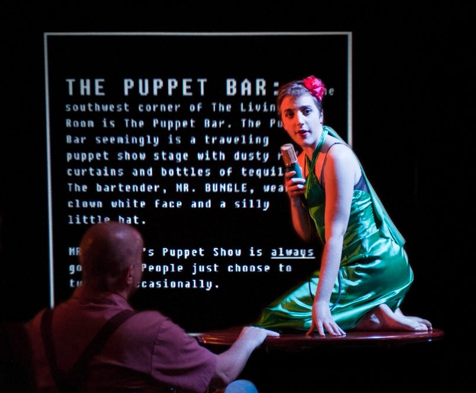

<!-- [[Philosophy]] -->

몇 주 전, 데이비드 차머스(David Chalmers)의 신간, '[Reality+](https://wwnorton.com/books/9780393635805)'가 출판되었습니다! 차머스는 그의 책을 통하여, 컴퓨터 시뮬레이션과 같은 가상세계와 우리의 일상생활이 이루어지는 현실세계 사이에서 발생하는 전반적인 문제와 철학적 담론들을 소개하고 쉽게 설명하고자 합니다. 과연 요즘과 같은 메타버스 열풍에 정말 시기적절하다고 생각이 드는군요... 게다가 '[철학적 좀비](https://ko.wikipedia.org/wiki/%EC%B2%A0%ED%95%99%EC%A0%81_%EC%A2%80%EB%B9%84)'라는 유명한 사고 실험을 제안한 철학자가 설명하는 가상세계라니! 정말로 기대를 하지 않을 수가 없습니다!

하지만 메타버스는 단순히 [유행어(buzzword)의 확산일 뿐](https://brandequity.economictimes.indiatimes.com/news/digital/metaverse-seems-more-like-a-marketing-buzzword-elon-musk/88466014)이라는 입장은 현재의 가상세계 논의가 조금 지나치다고 생각하는 것 같습니다. 그러나 가상과 현실을 연결하여 바라보는 일은 꽤 오래전부터 다루어져 온 듯합니다. 닉 보스트롬(Nick Bostrom)은 2003년, [시뮬레이션 가설(Simulation hypothesis)](https://ko.wikipedia.org/wiki/%EB%AA%A8%EC%9D%98%EC%8B%A4%ED%97%98_%EA%B0%80%EC%84%A4)을 바탕으로 우리의 모든 삶과 우주가 컴퓨터 시뮬레이션으로 구현되었을 가능성이 있다는 주장을 하였습니다. 우리가 현실이라고 여기는 세계가 사실은 가상적인 허구라는 생각은, 통 속의 뇌(brain in a vat) 사고 실험과 데카르트의 전능한 악마 가설까지 이어질 수 있을 것입니다. 범위를 더 넓힌다면, 플라톤의 동굴의 비유와 장자의 나비의 꿈 이야기까지 나아갈 수도 있겠지요. 어쩌면 수 천 년 인류의 역사가 매트릭스의 위협을 받고 있었다고 말하여도 과언이 아닐 것 같습니다.

최근 Current Arrairs 매거진의 편집장인 네이선 J. 로빈슨(Nathan J. Robinson)은 차머스의 'Reality+'에 대해 다소 원색적인 비판을 하였습니다(원문은 하단을 참고해주세요!). 차머스의 이야기는 현실과 가상 사이의 경계를 의도적으로 흐리는데 이는 결과적으로 현실에 커다란 악영향을 미칠 것이고, 우리의 삶은 절대로 시뮬레이션이 될 수 없다는 점이 그의 중심 논지입니다. 가상세계를 향한 이러한 걱정은 어느 정도 유효하다고 생각합니다. 디스토피아를 장르로 삼는 수많은 작품들이 현실에 침투하는 가상세계의 위협적인 모습을 그려내고 있으니까요. 가령 영국의 드라마 시리즈 '블랙 미러'의 '[보이지 않는 사람들](https://namu.wiki/w/%EB%B8%94%EB%9E%99%20%EB%AF%B8%EB%9F%AC/%EC%97%90%ED%94%BC%EC%86%8C%EB%93%9C#s-2.4.5)' 에피소드는 군인의 신경을 조작하여 특정한 인간 집단을 벌레로 보이게 만들어, 군인으로 하여금 그들을 죄책감없이 사살하도록 이끄는 프로그램이 등장합니다.

그러나 차머스의 가상세계 논의가 사변적인 주제로만 한정되는 것은 아니라고 생각합니다. 우리는 이미 오래전부터 인터넷과 같은 가상적인 요소와 긴밀한 관계를 맺어왔고, 이를 기반으로 수많은 일상의 서비스와 시스템을 구축하였으며, 근래의 증강현실과 같은 디지털 기술의 급속한 발전은 현실과 가상의 틈새를 더욱 빠르고 촘촘하게 메워 나갈 것입니다. 따라서 우리는 가상세계의 요소를 다룰 수 있는 적절한 현실의 개념을 어서 마련해야 할지 모릅니다. 가상의 요소를 올바르게 판단할 수 있는 현실의 기준을 마련하지 못한다면, 우리는 가상세계가 만들어내는 다양한 차원의 딜레마에 빠져버리게 될 것입니다. 차머스는 이에 대처하기 위해, 가상세계와 현실세계를 동일한 선상에 놓고 바라보아야 함을 주장합니다.

[이미지 출처](https://robmyers.org/category/lambdamoo/)

차머스는 [MUD(multi-user domain)](https://ko.wikipedia.org/wiki/MUD)라는 오래된 텍스트 기반 게임에서 발생한 범죄에 대해 이야기합니다. [LambdaMOO](https://www.youtube.com/watch?v=NgB6S2KQ8qo)라는 MUD 게임에서, 한 유저가 특정한 아이템을 사용하여 다른 유저로 하여금 성적이고 폭력적인 행동을 하도록 조작하는 사건이 발생하게 됩니다. 당연히 피해자는 심리적으로 큰 충격을 받았고, 해당 문제를 일으킨 가해자는 게임에서 영구적으로 추방되었습니다. 우리는 MUD에서 발생한 폭력이 현실과 분리된 가상의 성질이 아닌, 실제로 피해자에게 일어난 폭행이라는 점에 동의할 수 있을 것입니다. 가상세계에서 일어나는 일은 실제 현실세계에서 일어나는 일과 동일하게 의미를 가질 수 있기 때문입니다. 하지만 가상세계가 허구라고 생각하는 누군가는, 위의 사건이 심각한 폭력임은 맞지만 실제 폭력과는 근본적으로 다른, 마치 독자가 소설 속에서 폭행을 당하는 독자 자신의 모습을 읽게 되는 것과 같은, 차원이 다른 경험이라고 주장할 수 있습니다. 또한 위의 사건이 실제 세계에서 일어난 성폭행만큼 나쁘기에, 동일한 강도로 처벌해야 한다는 주장에 대해, 우리는 쉽게 답을 내릴 수 없을 것입니다. 일반적으로 텍스트를 기반으로 하는 가상의 신체는 현실의 물리적인 신체만큼 중요하다고 여겨지지 않기 때문입니다.

가상세계에서는 유저 간 아이템 사기와 같은 절도의 문제도 빈번하게 발생합니다. 그런데 만약 가상세계가 허구이고, 따라서 가상적인 요소들은 현실의 요소보다 의미를 가지는 비중이 적으며, 곧 가상 재화의 가치도 현실에 비해 떨어진다는 가정을 유지한다면, 가상세계의 절도는 현실세계의 절도보다 약하게 처벌되어야 할까요? 그런데 잠깐, 가상세계가 허구라면 가상세계의 재화 또한 허구라고 말할 수 있을 텐데, 어떻게 실제로 존재하지 않는 물체를 훔칠 수 있다는 것일까요? 가령 우리는 현실에서 자동차를 소유할 수 있습니다. 그리고 자동차는 분명히 우리의 눈앞에 물리적인 실체로 존재하지요. 그런데 게임 아이템은 조금 달라 보입니다. 우리는 특정한 게임 아이템을 소유한다고 생각하지만, 실제로 우리가 물리적으로 얻게 되는 것이 아닙니다. 아이템은 단지 화면에 작은 픽셀로 표현될 뿐이지만, 우리는 그것을 마치 지갑 속의 동전처럼 인벤토리에 소유하고 있다고 생각하게 됩니다. 물론 현실에서 이미 [가상 절도 범죄에 대한 처벌](https://www.sciencetimes.co.kr/news/%E5%92%8C%EB%B2%95%EC%9B%90-quot%EA%B0%80%EC%83%81%ED%98%84%EC%8B%A4-%EC%95%84%EC%9D%B4%ED%85%9C-%EC%A0%88%EB%8F%84%EB%8F%84-%EB%B2%94%EC%A3%84%ED%96%89%EC%9C%84quot/)이 시행된 바 있으며, 우리는 대체 불가능 토큰(Non-Fungible Token, NFT)과 같은 디지털 기술을 활용하여 특정한 아이템에 대한 개인의 소유권을 주장할 수도 있을 것입니다. 다만, 그럼에도 현실과 가상의 양방향적인 변환이 발생하는 명확한 지점을 설명해야 한다면, 여전히 우리는 쉽게 대답 할 수 없을 것입니다. 

그리고 조금 이상하지 않나요? 우리는 위에서 가상의 텍스트 신체보다 현실의 신체를 더 의미 있는 것으로 여긴 반면, 가상 재화에 대해선 현실의 재화와 동일하게 가치를 지니는 것으로 여기고자 하였습니다. 그렇다면 가상세계를 그저 현실을 모방한 허구라고 생각해야 할까요, 아니면 현실세계와 동등한 가치를 지닌 세계로 바라보아야 할까요? 또한 가상세계는 현실을 무대로 삼고 있지만, 현실세계와는 다른 작동 방식을 가집니다. MUD에서 발생한 사건으로 돌아가보면, 게임에서 추방된 가해자의 데이터는 영구적으로 말소되었지만, 얼마 지나지 않아 가해자는 새로운 유저의 모습을 하고 게임에 다시 참여하였다고 합니다. 이는 현실세계와는 다른 새로운 대처 방식이 가상세계에 요구되고 있음을 의미합니다.

이처럼 현실과 가상이 교차하는 지점에서 발생하는 다양한 윤리적, 법적 문제들을 바라보는 일은 상당히 혼란스럽습니다. 그러나 현재의 기술 발전의 속도를 고려한다면, 가상세계가 게임을 넘어서 우리의 부분적인, 혹은 완전한 일상으로 매겨지는 일은 더 이상 먼 미래의 이야기가 아닐 것 같습니다. 그렇기에 차머스는 가상세계가 단순히 현실 도피적인 게임 환경일 뿐이라는 인식에서 벗어나 진정한 현실로써 취급하여, 가상과 현실을 모두 아우를 수 있는 새로운 인식을 추구해야 한다고 주장합니다.

그러나 가상세계와 현실세계를 동일하게 바라보는 일은 깊은 숙고를 바탕으로 단계적으로 진행되어야 할 것 같습니다. 만약 가상세계와 현실세계가 동일한 가치를 지닌다면, 가상세계의 아바타를 죽이는 일은 실제 현실세계의 살인사건에 버금간다고 할 수 있을까요? (이런... 이럴 줄 알았으면 콜 오브 듀티와 같은 무시무시한 게임을 하지 말았어야 했는데... 당연히 농담입니다.) 하지만 가상세계와 현실세계의 합일을 이야기하기에 앞서, 먼저 가상세계가 진정으로 무엇을 의미하는지, 그리고 가상세계는 어떻게 현실세계와 연결될 수 있는지 보다 자세하게 탐구하는 일이 필요하다고 생각합니다. 우리는 지금까지 가상세계와 현실세계의 대립을 당연하게 생각하고 있었지만, 정말로 가상과 현실은 서로 대립하는 대상일까요? 가상은 '현실이 아닌 것'만을 의미하는 개념으로 생각해야 할까요? 어쩌면 우리가 생각하는 가상세계가 암묵적인 편견에서 비롯한 오해일 수도 있지 않을까요?

아직 나아가야 할 길이 멀지만, 분량을 적절히 분배하기 위해 이번 글은 현실과 가상을 아우르는 논의의 필요성을 소개하는 차원에서 마무리하겠습니다. 다음 글은 가상과 현실의 이분법적인 대립 구도에 의문을 던지는 게임학 연구 한 편을 바탕으로, 가상세계를 바라보는 일을 다시 한번 진행해보겠습니다.

* * *

- [데이비드 차머스의 블로그](https://consc.net/reality/). 신간 'Reality+'에 대한 간략한 설명과, 다양한 매거진의 북리뷰를 확인하실 수 있습니다.
- 본문의 MUD 이야기는 [차머스가 작성한 아티클](https://www.wired.com/story/crime-metaverse-virtual-reality/)을 참조하였습니다.
- 네이선 J. 로빈슨의 ['Reality+' 비판 아티클](https://www.currentaffairs.org/2022/02/unfortunately-we-are-not-living-in-a-simulation). 다만 저자의 무자비한 공격을 견뎌내셔야 합니다!

[브런치에 작성한 나의 글](https://brunch.co.kr/@a75fe69376a1428/8)을 블로그에 옮겨본다.
