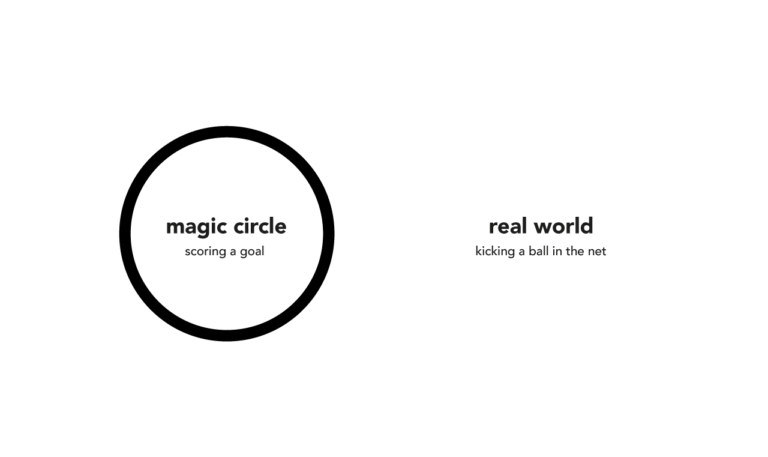
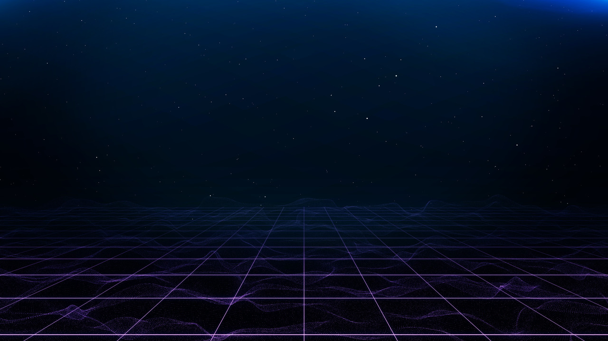

<!-- [[Philosophy]] -->

[지난 에세이](https://brunch.co.kr/@a75fe69376a1428/8)는 텍스트 기반 게임에서 발생한 사건을 바탕으로, 현실세계와 가상현실을 모두 아우를 수 있는 논의를 마련하여야 두 세계 사이에서 발생할 수 있는 다양한 문제를 적절하게 해결할 수 있다는 주장으로 끝을 맺었습니다. 그리고 몇 가지 질문을 제시하였죠: 현실세계와 가상현실은 서로 대립하는 관계일까? 그렇다면 가상현실은 도대체 무엇일까? 가상현실은 현실세계의 허상으로 구성된 허구적인 세계일까? 일상의 측면에서 가상현실은 현실세계보다 한 단계 가치가 떨어지는 차원으로 여겨지는 것처럼 보입니다. 분명히 게임 속 자동차와 현실의 자동차는 다른 가치를 가지고, 일반적으로 현실의 자동차가 보다 높은 가치를 지니죠. 그리고 다들 한 번쯤, 어른들에게 게임할 시간에 책 한 권을 더 읽으라는 잔소리를 들어본 경험을 가지고 있을 것이기도 하구요. ㅎㅎ 하지만 우리는 게임을 하며 일상에서는 느낄 수 없었던 즐거운 경험을 만들어낼 수 있고, 누군가는 게임으로부터 특별한 감동을 받기도 합니다. 하지만 가상현실이 현실세계보다 낮은 차원의 가치를 지닌다면, 혹은 가상현실이 소설과 같은 허구성만 가질 뿐이라면, 우리가 가상현실에서 얻게 되는 모든 요소는 단순한 장난에 불과한 것일까요?

현실세계와 가상현실을 이분법적으로 분리하는 관점은 비단 일상뿐만 아니라, [게임학(game studies)](https://ko.wikipedia.org/wiki/%EA%B2%8C%EC%9E%84%ED%95%99)에도 커다란 영향을 미쳤다고 합니다. 대표적으로는 요한 하위징아(Johan Huizinga)의 '매직 서클(magic circle)' 개념이 있습니다. 매직 서클은 일상의 규칙이 적용되지 않는, 즉 일상 바깥의 자유로운 활동으로, 정해진 규칙에 의해 경계 안에서 질서 정연하게 진행되며, 해당 활동의 참가자들을 강력하게 흡수합니다. 게임은 매직 서클의 적절한 예시가 될 수 있습니다. 게임의 규칙은 일상의 규칙과 다른 모습을 보이고, 사용자로 하여금 일상에서보다 자유로운 활동을 가능하게 하며 동시에 플레이의 몰입을 가져올 수 있기 때문이죠. 매직 서클과 게임의 연관성은 게임학계에 큰 반향을 불러일으켰고, 게임은 일상과 독립된 또 다른 세계가 되어, 오히려 플레이어는 물리적인 세계와 단절되어야만 최상의 플레이의 경험을 누릴 수 있는 것으로 여겨졌다고 합니다. 하지만 매직 서클의 이분법적인 관점에 반대하는 게임학 연구자들도 있었고, 이번 에세이에서 다루는 빌리 레돈비르타(Vili Lehdonvirta)의 연구[1] 또한, 이분법적인 관점으로 바라보는 가상현실의 개념은 오해를 불러올 수 있다고 주장합니다.

([이미지출처](https://gdt.stanford.edu/what-is-the-magic-circle/))

레돈비르타는 다수의 사용자가 네트워크에 동시 접속하여 활동할 수 있는 게임과 환경(massively-multiplayer online games and virtual environments, MMO)을 바탕으로 하여 게임과 가상현실을 바라봅니다. 일반적으로 MMO는 현실에서 실행하기 힘든 사회 실험을 수행하는 시뮬레이션의 장으로 여겨지거나, 공상과학소설(SF)의 내용이 구현된 평행세계의 이미지로 미디어에 등장하였는데, 저자는 MMO에 대한 이러한 인식이 현실(real)과 가상(virtual)의 대립을 근거로 하기 때문에 온전히 받아들일 수 없다고 말합니다. 저자는 MMO 연구에서의 대립구도(현실-가상)가 인터넷과 롤플레잉 게임에서 시작되었다고 생각합니다. 과거 인터넷 담론에 등장한 "IRL(in real life)"과 "사이버 스페이스(cyberspace)"와 같은 용어의 사용은 "실제 생활공간(meatspace)"과 분리된 활동과 공간으로써 개념화되었고, 이는 1996년, 존 페리 바를로(John Perry Barlow)가 인터넷에 게시한 '[사이버스페이스 독립선언문](https://ko.wikipedia.org/wiki/%EC%82%AC%EC%9D%B4%EB%B2%84%EC%8A%A4%ED%8E%98%EC%9D%B4%EC%8A%A4_%EB%8F%85%EB%A6%BD%EC%84%A0%EC%96%B8%EB%AC%B8#cite_note-2)'에도 드러나있습니다.

> "우리 세계는 너희의 세계와 다르다 ... 너희가 생각하는 재산, 표현, 정체성, 운동, 맥락에 관한 법적인 개념들은 우리에게 적용되지 않는다. 그것들은 물질에 기반하는 데 사이버스페이스에는 아무런 물질이 없다 ... 우리는 사이버스페이스에서 마음의 문명을 건설할 것이다. 그것은 너희 정부가 이전에 만든 것보다 더 인간적이고 공정한 세상이 될 것이다."

그리고 저자는 롤플레잉 게이머들이 "게임 내(in-game)"와 "게임 바깥(out-of-game)"이라는 용어를 사용하며, 게임과 게임 바깥의 세계 사이에 선을 긋는다고 말합니다. 그리고 이러한 경계는 위에서 설명한 '매직 서클'로 이어질 수 있습니다.

많은 학자들이 이분법적인 모델을 바탕으로 가상현실과 현실세계 사이에서 발생하는 다양한 문제들을 해결하고자 하였습니다. 가령 게임 내 가상자산의 실물거래와 같은 법적 이슈를 처리하는 과정에서, 모델의 관점에 따르면 게임 플레이는 일상적인 삶의 논리에 부합하는 것이 아니기에, 법은 게임 플레이를 일상의 경우와 다르게 취급해야 한다는 결론을 도출할 수 있습니다. 하지만 이분법적인 모델에는 여전히 가상현실과 현실세계의 관계를 적절하게 설명하지 못하는 지점이 있습니다. 예를 들어, 현실세계의 아이덴티티와 가상현실의 아이덴티티에 대해, 매직 서클에 의하면 현실세계와 가상현실은 서로 분리된 세계이기에, 두 아이덴티티의 연결 또한 불가능하게 됩니다. 하지만 우리는 현실세계의 이야기를 가상현실에서의 채팅을 통해 나눌 수 있듯이, 서로 다른 세계임에도 불구하고 두 아이덴티티는 서로 연결될 수 있는 것처럼 보입니다. 또한 가상현실의 경제 시스템이 현실세계의 경제 시스템과 다른 작동방식을 가지더라도, 여전히 현실세계의 경제 시스템에서 크게 벗어나지 않는다고 말할 수 있습니다. 동시에 가상현실에서 만들어지는 법과 규칙 또한 현실세계의 법과 규칙을 바탕으로 해석하고 만들어진 것이라고 볼 수 있겠지요. 현실과 분리된 가상이라는 개념은 분명히 특정한 현상을 설명하는 데 유용할 수 있지만, 가상현실을 단순히 현실세계의 대립항으로만 보게 된다면, 연구자들은 가상현실의 중요한 지점을 놓치게 될 수 있음을 저자는 이야기합니다.

저자는 사회학자 안슬렘 스트로스(Anselm Strauss)의 관점을 공유하여, 전체론적인 관점으로 현실세계와 가상현실을 바라봄으로써 이분법적 모델의 한계를 극복하려 합니다. 스트로스에 따르면, 사회적 현실은 다양한 차원의 수많은 담론들로 구성되며, 이들은 서로 겹치고 얽혀있는 형태를 가집니다. 가령, 한 사람에게 가족, 직장, 운동 모임, 유권자 등 다양한 사회적 세계들이 연결될 수 있는 것처럼요. 동일하게 게임의 사회적 세계 또한 유저, 운영자, 길드, 개발자, 서버, 온라인 포럼, 게임 매거진과 같이 무궁무진하게 확장될 수 있습니다. 이처럼 사회적 세계는 현실과 가상의 구분 없이 다양한 담론들과 얽히고 교차하기에, 이분법적 모델처럼 현실과 가상 사이에 명확한 경계를 설정하는 일은 어렵게 됩니다. 가상현실이 특정한 '세계'로 분리되지 않기에, 실황 플레이와 같은 '[보는 게임](https://gamegeneration.or.kr/board/post/view?match=id:70)'이 또 다른 게임의 경험으로 남을 수 있다고 생각도 드네요. ㅎㅎ 결과적으로, 전체론적 관점을 고려한다면, 가상현실의 정치, 물품, 규범 등의 요소들을 현실세계의 '시뮬레이션'된 '가상적 버전'으로 구분할 필요가 없게 됩니다. 그리고 '가상'이라는 개념은, 그것이 비현실적이거나 현실로부터 파생되는 이차적인 것이 아닌, 컴퓨터 매개체임을 나타내는 것으로 이해가 되어야 한다고 저자는 주장합니다.

이제 우리는 앞에서 제기했던 몇 가지 질문들에 대해 답을 할 수 있습니다. 가상현실과 현실세계와 대립하는 이분법적인 관점에서 벗어나 사유하는 것이 가능하며, 이는 가상현실이 허구나 현실의 모조품이 아닌, '컴퓨터를 매개로 하는' 형태라는 인식을 바탕으로 삼습니다. 그렇다면 이전 에세이에서 소개하였던 데이비드 차머스(David Chalmers)는 가상현실에 대해 어떠한 입장을 가지고 있을까요?

가상과 현실을 다루는 그의 연구[2]를 보면, 차머스 또한 동일한 방식으로 가상현실을 여기고 있는 듯합니다. 차머스는 '가상적 X(virtual X)'를 '컴퓨터를 기반으로 하는 X의 형태(a computer-based version of X)'라는 의미로 해석하여, 이러한 관점에서 가상현실은 현실의 한 형태로 여겨질 수 있다고 주장합니다. 비록 가상현실에 대해 보편적으로 합의된 정의는 아직 존재하지 않지만, 차머스는 그럼에도 가상현실에는 **몰입적이고(immersive), 상호작용이 이루어지는(interactive), 컴퓨터에 의해 만들어진 환경(computer-generated environment)**이라는 세 가지 핵심 요소가 포함된다고 말합니다. 이어서 차머스는 가상현실에 대해 다음과 같은 '가상적 디지털주의(virtual digitalism)'의 관점을 취합니다:

1. 가상적 대상은 실제로 존재하는 디지털적 대상이다.
2. 가상세계의 사건들은 실제로 발생하는 디지털적 사건들이다.
3. 가상현실의 경험은 디지털 세계에서의 비-환상적 자각을 포함한다.
4. 디지털 세계의 가상적 경험들은 비-디지털 세계의 비-가상적 경험만큼 의미 있을 수 있다.

레돈비르타는 전체론적인 관점을 취함으로써 가상현실을 허구로부터 떼어놓지만, 차머스는 보다 인식적인 차원에서 가상현실이 허구가 아니라는 점을 증명하고자 합니다. 차머스는 가상적 대상을 컴퓨터에 의해 구현된 디지털 대상으로 바라봅니다. 가상적 대상은 물리적으로 존재하는 컴퓨터의 데이터 구조에 의해 만들어지는 상위 차원의 존재로써, 마치 지점토와 조각상의 관계처럼, 데이터 구조가 사용자에게 어떠한 속성으로 인식됨으로써, 데이터 구조는 인과적인 힘을 가지는 가상적 대상이 됩니다. 따라서 가상적 대상은 가상세계에서 특정한 속성을 지니는 대상으로 인식되는 동시에, 현실세계에서는 컴퓨터의 프로세스에 의해 작동하는 데이터 구조로 존재하게 됩니다. 그렇기에 가상적 대상이 실제로 존재하지 않는 허구적인 대상이라는 논변에 대응할 수 있게 되지요. 이후 차머스는 몇 가지 논거를 덧붙이며 가상현실에서 허구를 분리하고자 지속적으로 노력을 기울입니다. 전체적인 핵심은, 우리는 가상현실에 '몰입'하여 가상적 환경을 실재하는 것으로 인식할 수 있고, 가상적 대상과 '상호작용'하며 관계를 맺을 수 있으며, 이러한 환경은 '컴퓨터에 의해 만들어진' 것이기에, 가상현실은 현실세계와 동일한 방식으로 실재한다고 말할 수 있다는 점입니다. 좀 더 간단하게 정리한다면, **컴퓨터의 디지털 프로세스는 실재하며, 가상현실은 컴퓨터의 디지털 프로세스로 구성되기에, 가상현실은 (가상현실의 방식으로) 실재한다**고 할 수 있습니다. 그리고 컴퓨터 프로세스가 물리적인 차원보다 낮은 차원의 성질이 아닌 한, 가상현실이 현실세계보다 낮은 단계의 현실이어야 할 필요가 없겠지요.

이제 마지막으로 질문에 대한 답을 정리하며 글을 마무리하겠습니다. 가상현실과 현실세계는, 가상이 컴퓨터를 매개로 하는 형태인 한 서로 대립하지 않습니다. 가상현실은 가상의 방식으로, 현실세계는 현실의 방식으로 서로 다른 형태를 가지며 존재하는 것이지요. 따라서 가상현실을 허구나 현실세계보다 존재론적 지위가 낮은 차원으로 여겨야 할 마땅한 이유가 없습니다. 가상 자동차는 가상현실에서 고유의 방식으로 작동하는 가상적 대상이고, 현실 자동차는 현실세계에서 고유의 방식으로 작동하는 물리적 대상입니다. 우리가 각 대상에 대해 가치를 다르게 매길 수는 있어도, 이러한 점이 가상현실 자체의 가치를 떨어뜨리는 것은 아니겠죠. 그리고 가상현실과 현실세계 사이에서 벌어지는 사회적인 갈등을 현명하게 해결하기 위해선, 가상현실의 작동방식을 면밀하게 파악하여, 그로부터 사회적 담론이 교차하는 지점들을 전체적으로 바라보아야 한다고 이야기할 수 있을 것 같습니다. 다소 원론적으로 느껴질 수도 있겠지만, [개인정보(privacy)](https://www.privacy.go.kr/nns/ntc/inf/personalInfo.do)와 같은 디지털 대상이 윤리적인 논의로 활발하게 다뤄지는 모습을 우리는 쉽게 확인할 수 있습니다.

하지만 글을 나가기 전에, 어딘가 찬 바람이 들어오는 것 같은 으스스한 기분이 들지 않으신가요? 가상현실과 현실세계가 동일한 존재론적 선상 위에서 서로 혼합될 수 있다면, 현실세계가 유일하고 본질적인 물리적 세계라는 사실이 조금 흔들릴 수도 있습니다. 레돈비르타는 우리가 지금까지 사용한 '가상현실'의 개념에 문제가 있다면, 동일하게 '현실세계'의 개념에도 문제가 있다고 주장합니다. 가상현실이 허구 또는 시뮬레이션으로 암묵적으로 받아들여져 왔다면, 현실세계 또한 유일하고 획일적인 현실로써 개념화되었을 것입니다. 차머스 또한 구조주의(structuralism)적인 입장을 취하며, 물리적 현실은 (고유한 본질로 존재하는 것이 아닌) 인과적 구조, 즉 물리적 대상 간의 상호작용 패턴과 그것이 우리의 경험에 미치는 영향에 의해 특징지어진다고 말합니다. 현실세계가 가상현실과 같이 인위적으로 만들어지고 가변적으로 변할 수 있는 것이라면, 우리가 지금까지 고유한 진실로써 믿고 있던 현실세계의 주장들은 과연 무엇일까요? 레돈비르타는 우리가 이분법적으로 파악하던 가상세계가 인식의 전환을 거친 이후 더 이상 존재하지 않게 되었다면, 역시 현실세계 또한 존재하지 않게 된다고 이야기합니다. 그렇다면 이제 우리의 눈앞에 남아있는 세계는 무엇일까요? 본질을 잃어버린 공허일까요, 통제할 수 없는 혼돈일까요? 다만 너무 걱정하지 않으셔도 됩니다. 단순히 술에 취한 사람의 헛소리일 수도 있으니까요!

(Free Stock photos by Vecteezy)

* * *
참고문헌
[1] [Lehdonvirta, Vili, Virtual Worlds Don't Exist: Questioning the  Dichotomous Approach in MMO Studies (January 1, 2010). Game Studies,  Vol. 10, No. 1, 2010](http://gamestudies.org/1001/articles/lehdonvirta)
[2] [Chalmers, David J.. "The Virtual and the Real" Disputatio, vol.9, no.46, 2017, pp.309-352.](https://www.consc.net/papers/virtual.pdf)

[브런치에 작성한 나의 글](https://brunch.co.kr/@a75fe69376a1428/15)을 블로그에 옮겨본다.
